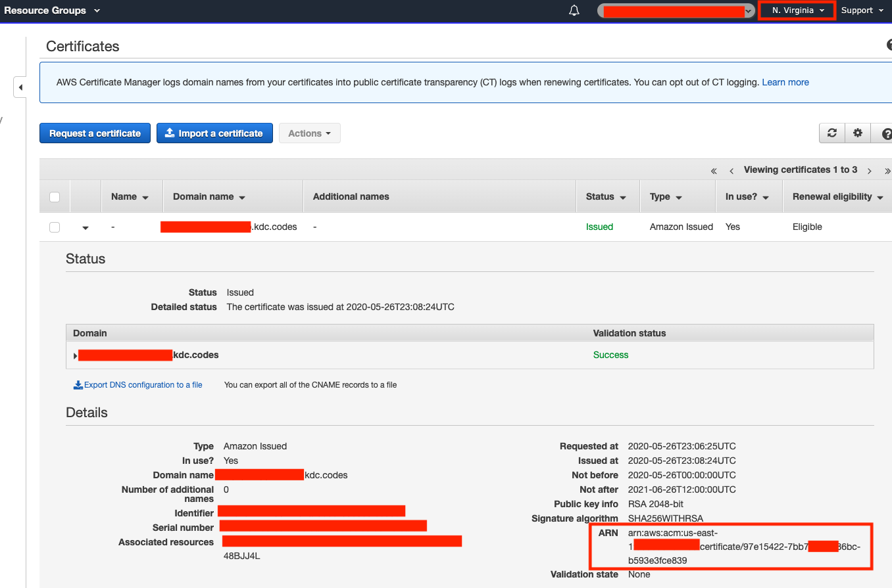
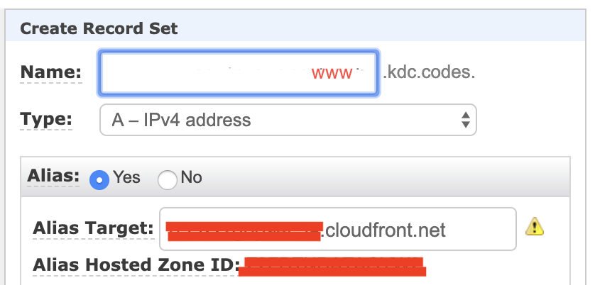

# S3 and CloudFront Serverless

## What does this do

- Setup your website in AWS using [Serverless Framework](https://www.serverless.com/).
- Creates resources for both root domain and www subdomain.
- Auto redirect root domain to www subdomain.
- Auto redirect http to https.
- Easy deployment using [aws cli](https://docs.aws.amazon.com/cli/latest/userguide/install-cliv2.html).
- Includes security headers using [AWS Lambda Edge](https://aws.amazon.com/lambda/edge/).
- Includes **CustomErrorResponses** for **React** based websites.

### Prerequisites

- Install [Serverless](https://www.serverless.com/framework/docs/getting-started/)

- Install [AWS Cli](https://docs.aws.amazon.com/cli/latest/userguide/install-cliv2.html)

- Create an [AWS Profile](https://docs.aws.amazon.com/cli/latest/userguide/cli-chap-configure.html)

- Create an SSL Certificate from AWS Console. Make sure you are in region **US East (N. Virginia)** (`us-east-1`). Take note of the certificate **ARN**.

  

### Clone this Repo

```terminal
git clone https://github.com/kdcsoftware/s3-cf-serverless-website.git
cd s3-cf-serverless-website
```

### Configure

Create config file by copying `config.sample.yml` to `config.prod.yml`. Edit `config.prod.yml` and change values for **PROFILE**, **DOMAIN** and **DOMAIN_CERT**. DOMAIN is your root domain name (without _www_) and DOMAIN_CERT is the ARN value from the previous section.

### Create S3 and CloudFront

Create S3 and CloudFront resources.

```terminal
npm run deploy:setup prod
```

After successful deployment run:

```terminal
npm run deploy:info
```

Take note of the **CFEndpoint** and **CFDistributionIdWWW** in the output.

### Point Domain to CF

If your domain DNS is hosted on Route53, create a record set like below:



Alias target is the **CFEndpoint** from previous section.

If hosted outside of AWS, use CNAME.

Do this for both root domain and www subdomain.

### Deployment

Edit `package.json` and edit the lines below:

```json
"scripts": {
  ...
  "deploy:s3": "AWS_PROFILE=<PROFILE> aws s3 sync build/ s3://www.<DOMAIN>",
  "deploy:cf": "AWS_PROFILE=<PROFILE> aws cloudfront create-invalidation --distribution-id <CFDistributionIdWWW> --paths \"/*\"",
  ...
},
```

Replace **PROFILE**, **DOMAIN** and **CFDistributionIdWWW**.

### Deploy

```terminal
npm run deploy
```

This command will sync build folder with s3 bucket and invalidate cloudfront to reflect the new changes.

Enjoy!
